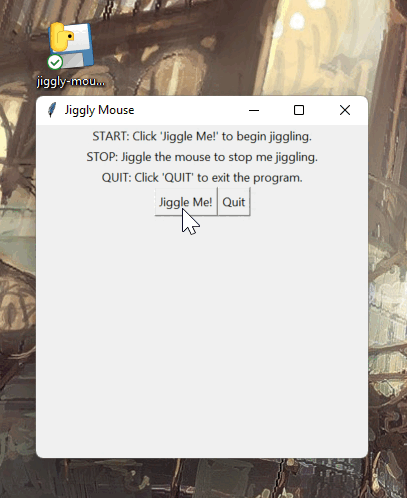

# Jiggly Mouse

> **Author:** David Boyd 
> **Date:** 2022-03-21

This program jiggles your mouse to prevent your computer from going to sleep or
to screensaver mode.  I wrote this program because most of the mouse jiggler
programs were written for only Windows.  This has been tested in both macOS
(Monterey) and Windows 11.  For argument's sake, I'll just assume this works in
Linux as this program was purposefully written in Python3 to be cross-platform.

## Installation

### Running the Binary

When running with the provided *(will be pushed soon)* binaries: 
  - :white_check_mark: Windows: `./binaries/jiggly-mouse-win-x64.exe`
  - :white_check_mark: macOS: `./binaries/jiggly-mouse-macOS.app`
  - :timer_clock: Linux: `./binaries/jiggly-mouse-linux.elf`
  - :x: WSL2+Kali-Win-Kex: No luck :shrug:

1. Download the platform relative binary to desired directory

2. Open the program where and accept the prompts

    - **macOS - Monterey**
	1. Unzip application
	2. Upon prompt: `Security & Privacy` > `Accessibility` > Allow `jiggly-mouse-macOS.app`
          - This is because the program is taking over your mouse

    - **Windows 11** 
      - Prompt: `Windows protected your PC` 
        1. Click `More info`
        2. Click `Run anyway`

    - Linux: **will update once tested**

  3. Program instructions will be provided in program as well 
    - **START:** Click `Jiggle` to jiggle the mouse 
    - **STOP:** Jiggle the mouse past its jiggling range to stop the jiggling 
    - **EXIT:** Click `Quit` to exit the program

### Running via Python3-CLI

#### Dependencies

- **PIP:** `PyAutoGui` for GUI mouse control
- ***macOS:*** `Tkinter` has issues, so good luck.  I messed up my soft-linked
  files by installing it via brew... dunno what else it messed up.
    - Running the `jiggly-mouse-macOS.app` binary resolves this issue.

#### Run via CLI

  - `python3 jiggly-mouse.py` or use whatever setup you have at this point.

